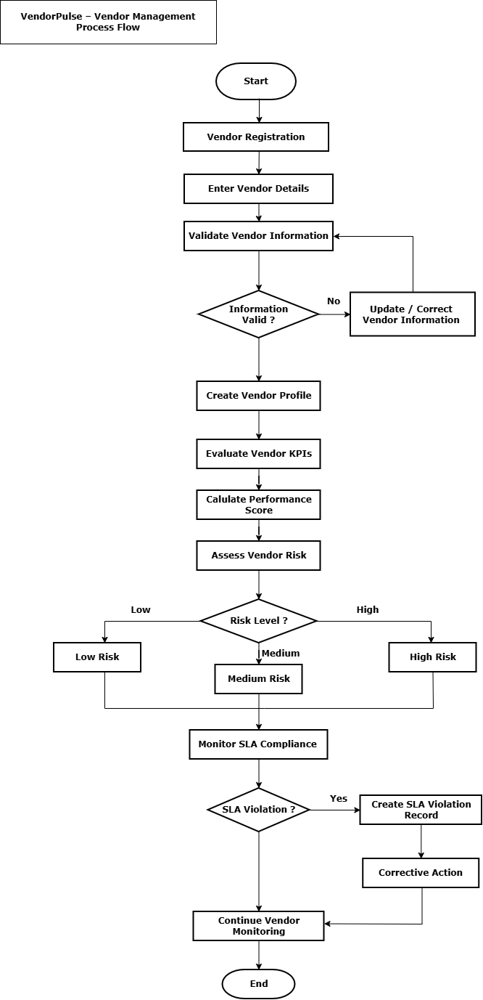
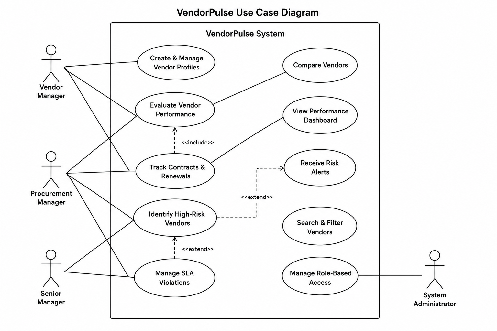
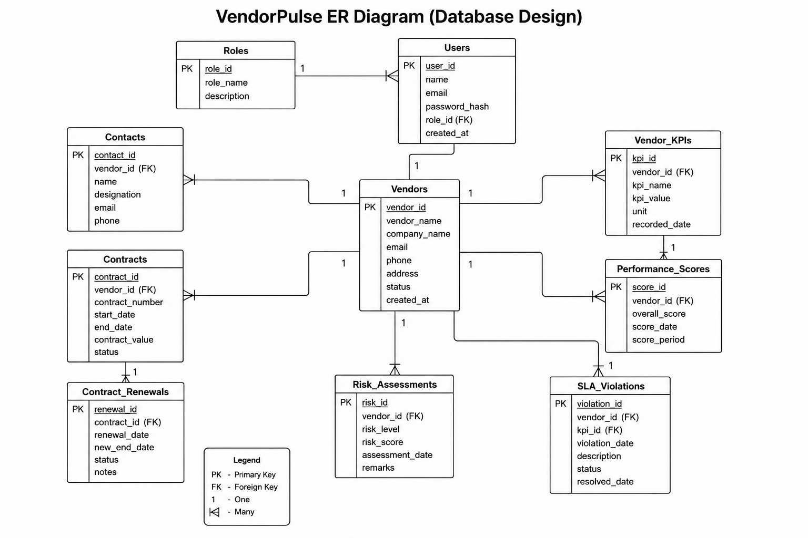

# VendorPulse – Vendor Performance & Risk Management System

VendorPulse is a **Business Analysis portfolio project** focused on designing a centralized vendor management system for managing vendor information, evaluating vendor performance, monitoring risks, tracking SLA violations, and supporting data-driven procurement decisions.

This project demonstrates an end-to-end **Business Analyst workflow** using requirements documentation, Agile/Scrum, Jira, process modeling, UML, and database design.

---

## Project Overview

Organizations often manage vendor information across spreadsheets, emails, and disconnected systems. This makes it difficult to consistently evaluate vendor performance, identify high-risk vendors, monitor SLA compliance, and compare suppliers.

VendorPulse provides a structured solution to centralize vendor information and support:

- Vendor profile management
- KPI-based performance evaluation
- Vendor risk assessment
- SLA monitoring
- Vendor comparison
- Performance dashboards
- High-risk vendor alerts
- Role-based access control

---

## Business Problem

The existing vendor management process may involve fragmented information across multiple sources, making vendor performance and risk monitoring difficult.

VendorPulse is designed to provide a centralized system where procurement and vendor management teams can track vendor information, evaluate KPIs, identify risks, monitor SLA violations, and make informed vendor-related decisions.

---

## Business Objectives

- Centralize vendor information
- Improve vendor performance visibility
- Standardize KPI-based vendor evaluation
- Identify high-risk vendors
- Monitor SLA compliance
- Track vendor performance over time
- Compare multiple vendors
- Improve procurement decision-making
- Provide management-level insights

---

## Key Features

- Create and manage vendor profiles
- Evaluate vendor performance using KPI scorecards
- Track vendor contracts and renewal dates
- Calculate vendor performance scores
- Identify and monitor high-risk vendors
- Track and manage SLA violations
- Compare multiple vendors
- View vendor performance dashboards
- Receive high-risk vendor alerts
- Search and filter vendor records
- Manage role-based access

---

## Business Analysis Deliverables

The project includes:

- Business Problem Statement
- Stakeholder Analysis
- Business Requirements
- Functional Requirements
- Non-Functional Requirements
- Requirements Traceability Matrix (RTM)
- User Stories
- Acceptance Criteria
- Jira Product Backlog
- Sprint Planning
- Tasks and Bugs
- Process Flow Diagram
- UML Use Case Diagram
- Entity Relationship Diagram

---

# Business Requirements Document

The complete VendorPulse Business Requirements Document contains:

- Business Problem Statement
- Stakeholder Analysis
- Business Requirements
- Functional Requirements
- Non-Functional Requirements
- Requirements Traceability Matrix

### View Document

[VendorPulse Business Requirements Document](Requirements/VendorPulse_BRD.pdf)

---

# Vendor Management Process Flow

The process flow represents the vendor management lifecycle from vendor registration through continuous performance and risk monitoring.

### Process

```text
Vendor Registration
        ↓
Enter Vendor Details
        ↓
Validate Vendor Information
        ↓
Create Vendor Profile
        ↓
Evaluate Vendor KPIs
        ↓
Calculate Performance Score
        ↓
Assess Vendor Risk
        ↓
Classify Risk Level
        ↓
Monitor SLA Compliance
        ↓
Check SLA Violation
        ↓
Corrective Action (if required)
        ↓
Continue Vendor Monitoring
```

### Process Flow Diagram



---

# UML Use Case Diagram

The Use Case Diagram represents interactions between VendorPulse users and the major capabilities of the system.

Major use cases include:

- Manage vendor profiles
- Evaluate vendor performance
- Monitor vendor KPIs
- Assess vendor risk
- Track SLA violations
- Compare vendors
- View dashboards
- Search vendor records
- Manage user access

### Use Case Diagram



---

# Entity Relationship Diagram

The ER Diagram represents the proposed data structure and relationships required for the VendorPulse system.

Major entities include:

- Users
- Roles
- Vendors
- Contacts
- Contracts
- Contract Renewals
- Vendor KPIs
- Performance Scores
- Risk Assessments
- SLA Violations

### ER Diagram



---

# Agile & Jira Implementation

VendorPulse was planned using **Agile Scrum methodology**.

Jira was used to manage:

- User Stories
- Acceptance Criteria
- Product Backlog
- Tasks
- Bugs
- Story Points
- Sprint Planning
- Workflow Status
- Sprint Execution

### Jira Sprint Board


---

# Sample User Stories

## Create and Manage Vendor Profiles

**As a Vendor Manager,**  
I want to create and manage vendor profiles,  
so that vendor information can be maintained in a centralized system.

### Acceptance Criteria

- User can create a new vendor profile.
- User can enter vendor details.
- Required fields are validated before saving.
- User can view and update vendor information.
- User can deactivate a vendor profile.
- System provides confirmation after successful creation or update.

---

## Evaluate Vendor Performance

**As a Vendor Manager,**  
I want to evaluate vendor performance using KPI scorecards,  
so that vendor performance can be measured consistently.

---

## Identify High-Risk Vendors

**As a Procurement Manager,**  
I want to identify and monitor high-risk vendors,  
so that vendor-related risks can be managed proactively.

---

## Track SLA Violations

**As a Vendor Manager,**  
I want to track vendor SLA violations,  
so that corrective actions can be taken when service expectations are not met.

---

# Requirements Traceability

A **Requirements Traceability Matrix (RTM)** was created to map business requirements to corresponding functional requirements.

The RTM helps ensure:

- Business requirements are covered
- Functional requirements support business objectives
- Requirement gaps can be identified
- Changes can be traced
- Requirement coverage can be validated

The complete RTM is included in the:

[VendorPulse BRD](Requirements/VendorPulse_BRD.pdf)

---

# Tools Used

| Tool | Purpose |
|---|---|
| Jira | User stories, backlog, tasks, bugs and sprint management |
| Draw.io | Process Flow, Use Case Diagram and ER Diagram |
| GitHub | Project repository and documentation |
| Markdown | README documentation |
| PDF | Business Requirements Document |
| Agile/Scrum | Project planning methodology |

---

# Skills Demonstrated

- Business Analysis
- Requirements Gathering
- Requirements Analysis
- Business Requirements Documentation
- Functional Requirements
- Non-Functional Requirements
- Stakeholder Analysis
- User Story Writing
- Acceptance Criteria
- Requirements Traceability Matrix
- Business Process Modeling
- UML Use Case Modeling
- ER/Data Modeling
- Product Backlog Management
- Sprint Planning
- Agile/Scrum
- Jira
- Workflow Design

---

# Repository Structure

```text
VendorPulse/
│
├── Diagrams/
│   ├── vendor_management_process_flow.png
│   ├── vendor_use_case_diagram.png
│   └── vendorpulse_er_diagram.png
│
├── Jira Screenshots/
│   └── vendorpulse-jira-sprint-board.png
│
├── Requirements/
│   └── VendorPulse_BRD.pdf
│
└── README.md
```

---

# Business Value

VendorPulse is designed to help organizations:

- Maintain centralized vendor information
- Improve visibility into vendor performance
- Identify high-risk vendors earlier
- Improve SLA monitoring
- Compare vendors consistently
- Reduce manual vendor tracking
- Improve procurement decisions
- Provide management with actionable vendor insights

---

# Project Outcome

VendorPulse demonstrates an end-to-end Business Analyst workflow:

```text
Business Problem
      ↓
Stakeholder Analysis
      ↓
Business Requirements
      ↓
Functional & Non-Functional Requirements
      ↓
User Stories & Acceptance Criteria
      ↓
Product Backlog
      ↓
Sprint Planning
      ↓
Process & System Modeling
      ↓
Requirements Traceability
```

The project demonstrates how a business problem can be converted into structured requirements, Agile work items, process models, and system designs.

---

## Author

**Raj Pratap Singh**

Business Analyst | Data Analyst

**Skills:** Business Analysis | SQL | Power BI | Excel | Python | Jira | Agile/Scrum | Requirements Analysis | Data Analysis
